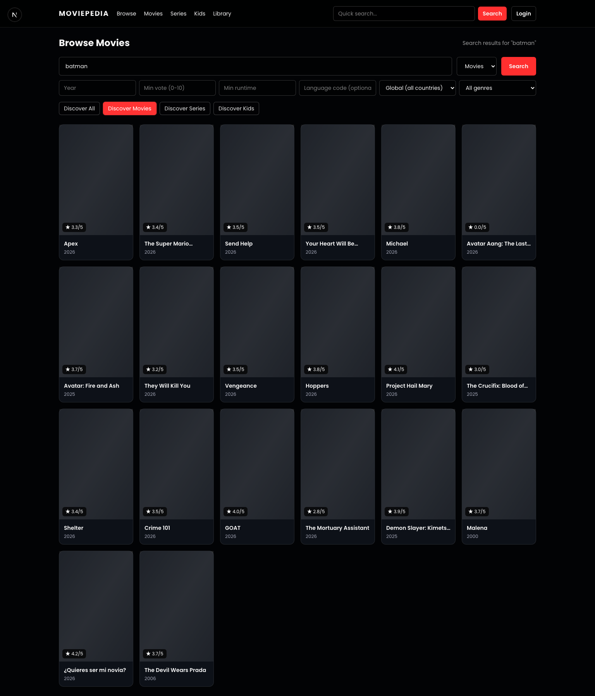
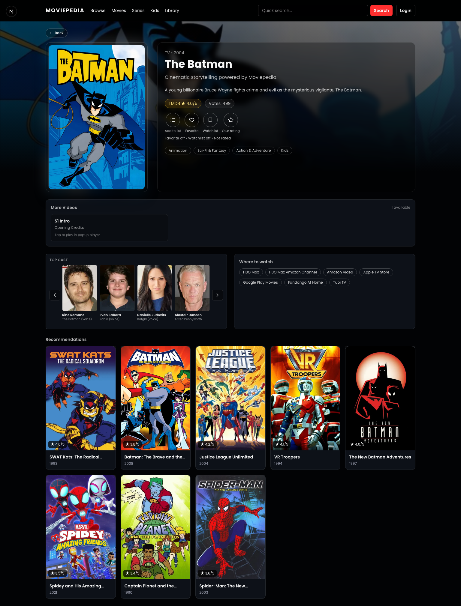
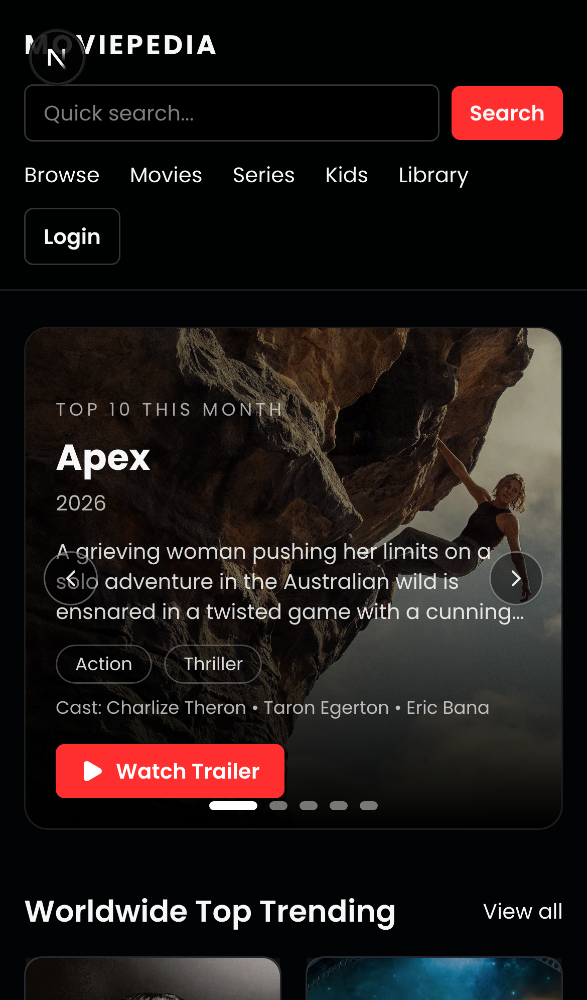
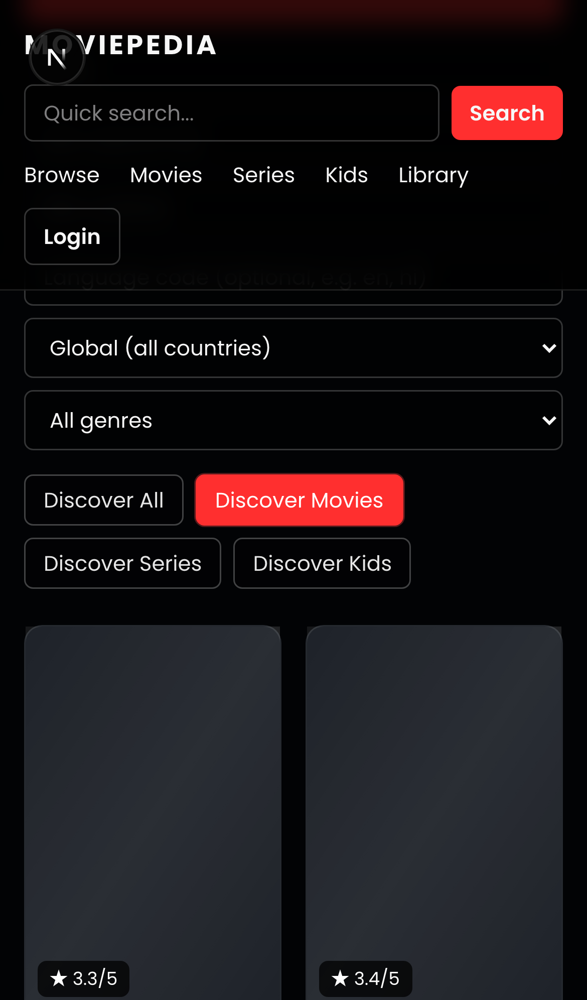

# Moviepedia

Moviepedia is a cross-platform movie discovery app built from a shared monorepo.
It includes a modern web app, a React Native mobile app, and a shared TMDB core package.

## Preview







## Workspace Structure

- `apps/web` - Next.js 16 + TypeScript web app
- `apps/mobile` - Expo React Native + TypeScript mobile app
- `packages/core` - Shared TMDB client, types, and account actions
- `legacy/cra-app` - Archived legacy CRA app
- `scripts/capture-portfolio-snapshots.mjs` - Playwright workflow screenshot automation

## What You Can Do

- Browse movies, series, kids, and mixed feeds
- Search TMDB content with filters (year, vote, runtime, language, country, genre)
- Open title detail pages with trailer, cast, providers, and recommendations
- Connect a TMDB account and use watchlist/favorite/rating actions
- Capture portfolio screenshots across web and mobile flows

## Prerequisites

- Node.js 20+
- npm 10+
- Xcode/Android tooling only if you run native simulators

## Install

```bash
npm install
```

## Run Apps

### Web

```bash
npm run dev:web
```

Open `http://127.0.0.1:3000`.

### Mobile (Expo)

```bash
npm run dev:mobile
```

For clean reload while testing:

```bash
npm run start -w @movie/mobile -- --clear
```

## Useful Scripts

- `npm run dev:web` - Start web app
- `npm run dev:mobile` - Start Expo app
- `npm run build:web` - Build web app
- `npm run typecheck` - Typecheck all workspaces
- `npm run lint` - Lint all workspaces
- `npm run capture:portfolio` - Generate web/mobile workflow screenshots into `portfolio-shots/`

## Environment Variables

The app needs TMDB keys for full functionality. Set environment variables in your local setup:

- Web (`apps/web/.env.local`) should include:
  - `NEXT_PUBLIC_TMDB_API_KEY`
- Mobile (Expo environment) should include:
  - `EXPO_PUBLIC_TMDB_API_KEY`

Optional TMDB account/session values can be set for advanced account flows, but runtime TMDB connect is already supported in app.

## Portfolio Snapshot Automation

The Playwright workflow script captures a full user journey (home, browse modes, search, detail, auth, library):

```bash
npm run capture:portfolio
```

Output:

- `portfolio-shots/web-*.png` (full-page web captures)
- `portfolio-shots/mobile-*.png` (mobile viewport-only captures)

## Notes

- This repository migrated from a legacy CRA app to a monorepo architecture.
- Legacy files are preserved in `legacy/cra-app` for reference/history.
